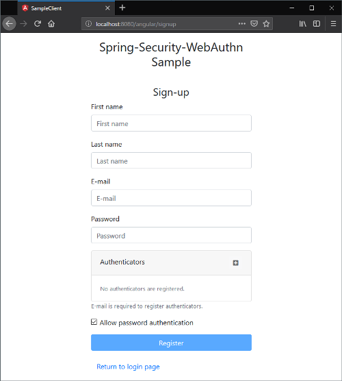
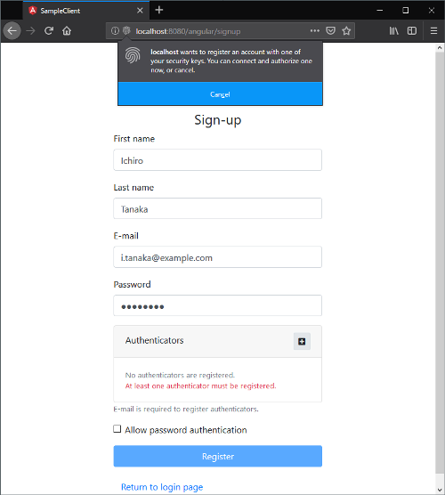

== Sample application

WebAuthn4J Spring Security contains a sample application demonstrates its major functionality.

=== Sample application execution

Sample application can be executed by following command.

[source,bash]
----
./gradlew samples:spa:bootRun
----

=== User and authenticator registration

The signup page can be accessed with `http://localhost:8080/signup`.
Please fill user information and register user and authentication device.

Click the "Add" button in the "Authenticators" table, it will show a pop-up asking you to give a gesture to the authenticator to acknowledge the registration.
In case of an accident or device loss, Multiple authenticators can be registered for backup.
If you would like to allow single-factor authentication, Please check "Allow password authentication".

=== User authentication

Login page can be accessed with `http://localhost:/8080/login`.
Sample application supports three authentication flow.

* Multi-factor authentication with password and authenticator
* Password-less multi-factor authentication with a user-verifying authenticator
* Single-factor authentication only with a password

Each of three authentication flows are explained below.

==== Multi-factor authentication with password and authenticator

If you register a non user-verifying authenticator like FIDO-U2F token, you can login with multi-factor authentication with password and authenticator.

image::images/login.png[login view]

Please fill the username (email address) and password on the login view and click the login button.

image::images/authenticatorLogin.png[authenticator login view]

If the password authentication succeeds, an authenticator is asked in the next authenticator login view.
When the pop-up opens, please give a gesture to the authenticator to finish the authentication.
You will be automatically redirected to the dashboard.

==== Password-less multi-factor authentication with a user-verifying authenticator

If you register a user-verifying authenticator like that supports FIDO-CTAP2, you can login without password.

image::images/login-with-edge.png[login view (password-less login)]

Click the "Password-less login" button on the login view and the pop-up asking an authenticator will be opened.
Please give a gesture to the authenticator to finish the authentication.
You will be automatically redirected to the dashboard.

==== Password authentication

If you checked "Allow password authentication" at user registration, standard password authentication is available.

image::images/login.png[login view]

Please fill the username (email address) and password on the login view and click the login button.
If the authentication succeeds, you will be automatically redirected to the dashboard.
