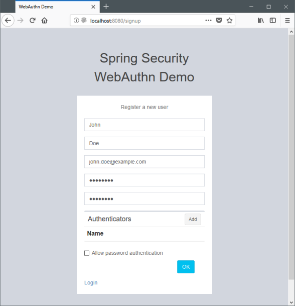
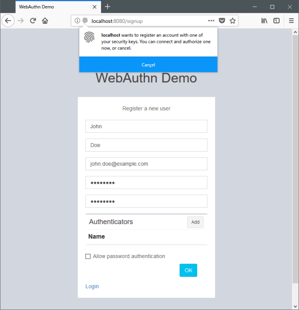
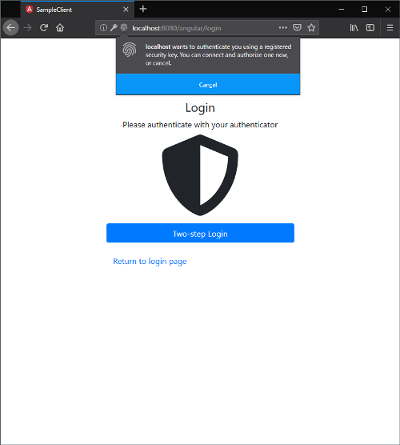
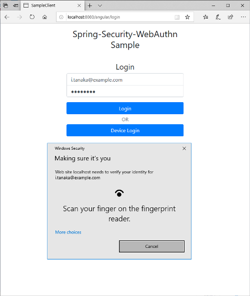

== サンプルアプリケーション

webauthn4j-spring-securityは主要機能をデモするサンプルアプリケーションを含みます。
Single Page Applicationのデモである、Sample SPAと、従来型のMulti Page Applicationである、Sample MPAです。以下ではSample SPAについて説明します。

=== サンプルアプリケーションの実行

サンプルアプリケーションは以下のコマンドで実行することが出来ます。

[source,bash]
----
./gradlew samples:spa:bootRun
----

=== ユーザーおよび認証デバイスの登録

サインアップ画面は、 `http://localhost:8080/angular/signup` でアクセスすることが出来ます。 ユーザー情報を入力し、ユーザーと認証デバイスの登録を行ってください。

「認証デバイス」欄の「追加」ボタンを押下すると認証デバイスでの操作を促すポップアップが表示され、 認証デバイスの登録モードになりますので、ポップアップに従い登録を済ませてください。 認証デバイスは紛失・故障に備え、バックアップとして複数登録することが出来ます。 パスワードのみによる単一要素認証を許可する場合は、「パスワード認証を許可」にチェックを入れてください。

=== ユーザー認証

ログイン画面は、 `http://localhost:/8080/angular/login` でアクセスすることが出来ます。 サンプルアプリケーションではユーザー認証について、三つの認証フローをサポートしています。

- パスワード＋認証デバイスによる多要素認証
- ユーザー検証機能付き認証デバイスによるパスワードレス多要素認証
- パスワードのみによる単一要素認証

以下、三つの認証フローについてそれぞれ説明していきます。

==== パスワード＋認証デバイスによる多要素認証

ユーザー検証機能が付いていないFIDO-U2Fのトークンのような認証デバイスを登録した場合は、パスワード＋認証デバイスによる 多要素認証が可能です。

image::images/login.png[ログイン画面]

ログイン画面でユーザー名（Emailアドレス）とパスワードを入力し、ログインボタンを押下してください。

パスワード認証に成功した場合、第二認証要素として認証デバイスを用いた認証を求める、認証デバイスログイン画面が開きます。 認証を求めるポップアップが開いたら、認証デバイスを操作し、認証を完了してください。認証に成功すると、画面が自動的に遷移します。

==== ユーザー検証機能付き認証デバイスによるパスワードレス多要素認証

ユーザー検証機能が付いている認証デバイスを登録した場合、パスワードレス認証が可能です。

ログイン画面の「パスワードレスログイン」ボタンを押下すると、認証デバイスを用いた認証を求めるポップアップが開きます。 認証デバイスを操作し、認証を完了してください。認証に成功すると、画面が自動的に遷移します。

==== パスワード認証

ユーザー登録時に「パスワード認証を許可」にチェックを入れていた場合、 通常のパスワード認証が利用可能です。

image::images/login.png[ログイン画面]

ログイン画面でユーザー名とパスワードを入力し、「ログイン」ボタンを押下して認証を完了してください。 認証に成功すると、画面は自動的に遷移します。
